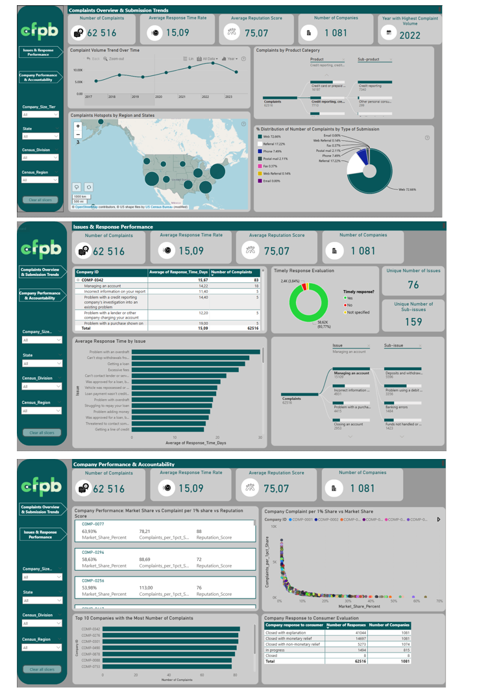

# Consumer Financial Complaints Dashboard

Power BI dashboard built for the Onyx Data community challenge.

## Overview
Analysed 62,000+ consumer complaints across 1,081 companies 
from the Consumer Financial Protection Bureau (CFPB).

## Key Insights
- Companies with smaller market share show disproportionately 
  high complaint rates
- 2022 recorded the highest complaint volume
- Web submission accounts for 72% of all complaints

## Tools Used
Power BI · DAX · Power Query · Data Modelling

## Dashboard Preview

## Challenge
Onyx Data Community Challenge
